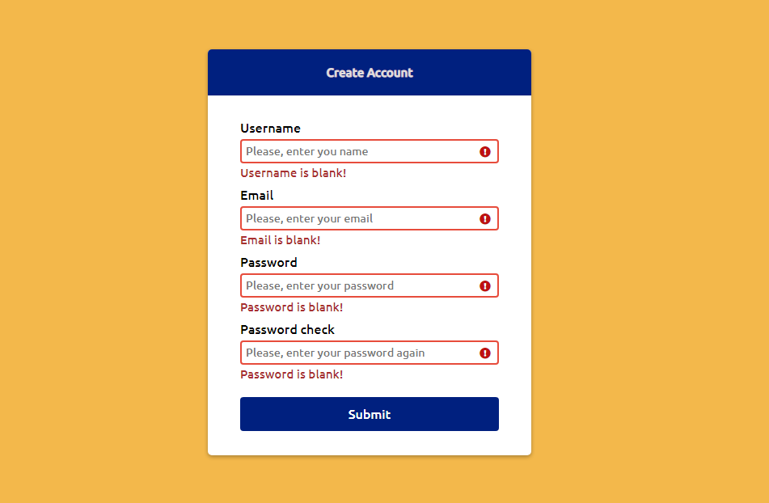
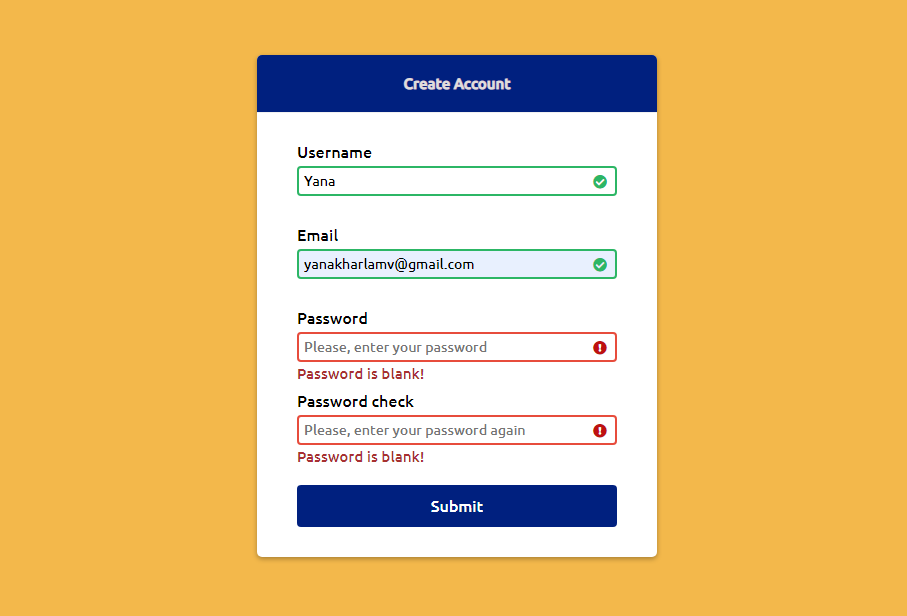
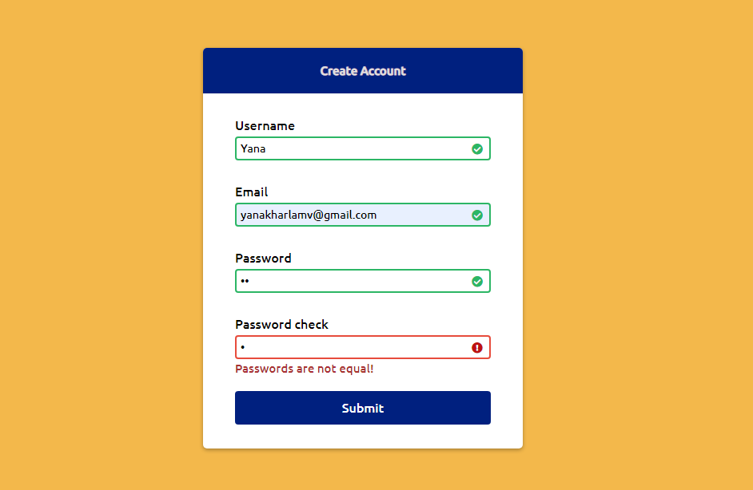
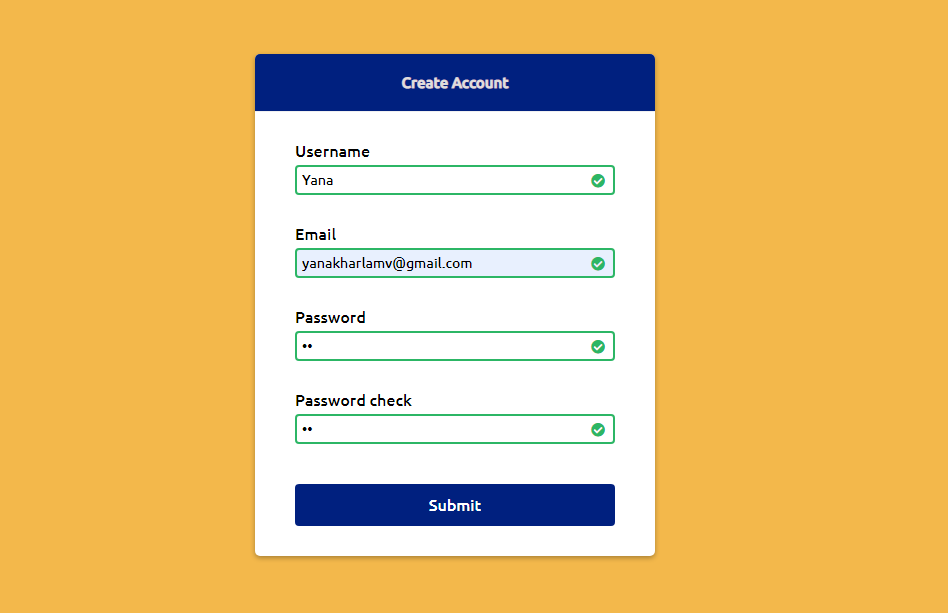

# ClientFormValidation
## About
Realization of client form validation.

Live version: https://yanakharlamova.github.io/ClientFormValidation.github.io/
## Built with:
* JS
* HTML
* CSS
* SCSS
## Implementation:
Main structure of this project is formed by these functions:

* Function to check Username, Email, Password and Password check input-fields for valid values:

**function checkInputs()**

* Function to set error messages and error class on fields that are blank or when passwords are not equal :

**function setError()**

* Function to set success class on fields with valid values:

**function setSuccess()**

* Function to check whether email addresses are valid:

**function isValidEmail()**
## Installing:
Run this commands in terminal:

**1)** `npm install` - to install project dependencies in the local node_modules folder;

**2)** `npm run sass` - to run the project.

## Screenshots:
**1.**

**2.**

**3.**

**4.**

